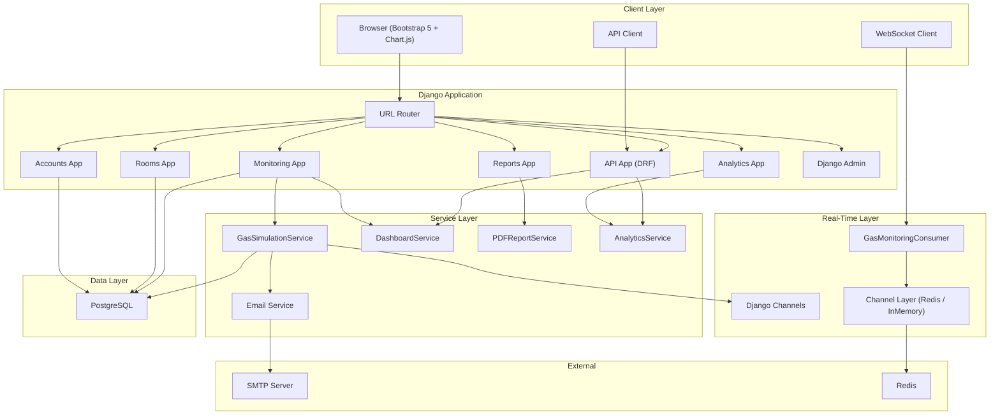
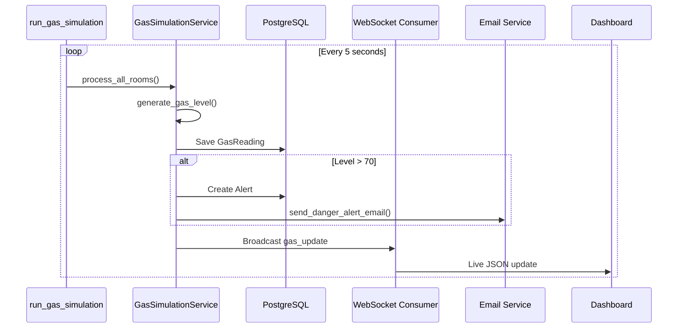
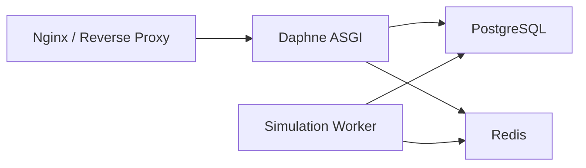

# Project Architecture

## System Overview



## Application Modules

| App | Responsibility |
|-----|----------------|
| `apps.core` | Landing page, seed data command |
| `apps.accounts` | User registration, login, profile, password |
| `apps.rooms` | Room CRUD (name, description, created date) |
| `apps.monitoring` | GasReading, Alert models, simulation engine, dashboard, WebSockets |
| `apps.analytics` | Statistical analysis and Chart.js views |
| `apps.api` | REST API serializers, viewsets, routers |
| `apps.reports` | ReportLab PDF generation |

## Request Flow — Gas Simulation



## Settings Architecture

```
config/settings/
├── base.py          # Shared: DB, DRF, Channels, email, thresholds
├── development.py   # DEBUG=True, InMemory channel layer
└── production.py    # Security headers, SMTP, Redis channel layer
```

## Deployment Topology (Production)



## Security

- All monitoring, room, analytics, and report routes require authentication (`LoginRequiredMixin`)
- API uses `IsAuthenticated` permission
- CSRF protection on all forms
- Production settings enforce HSTS, secure cookies, strict CORS
