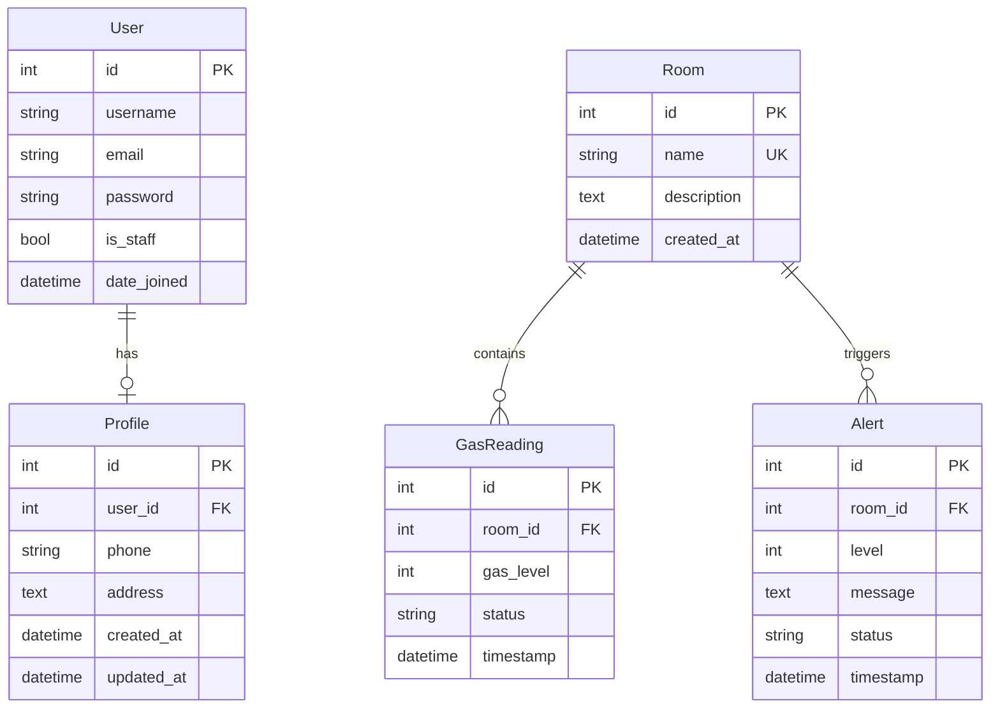

# Database Schema

## Entity Relationship Diagram



## Tables

### auth_user (Django built-in)

Standard Django user model for authentication.

### accounts_profile

| Column | Type | Constraints |
|--------|------|-------------|
| id | BigAutoField | PK |
| user_id | OneToOne → auth_user | CASCADE |
| phone | VARCHAR(20) | blank allowed |
| address | TEXT | blank allowed |
| created_at | DateTime | auto |
| updated_at | DateTime | auto |

### rooms_room

| Column | Type | Constraints |
|--------|------|-------------|
| id | BigAutoField | PK |
| name | VARCHAR(100) | UNIQUE |
| description | TEXT | blank allowed |
| created_at | DateTime | auto |

### monitoring_gasreading

| Column | Type | Constraints |
|--------|------|-------------|
| id | BigAutoField | PK |
| room_id | FK → rooms_room | CASCADE |
| gas_level | PositiveSmallInteger | 0–100 |
| status | VARCHAR(10) | SAFE / WARNING / DANGER |
| timestamp | DateTime | indexed |

**Indexes:** `(room_id, -timestamp)`, `(status, -timestamp)`

### monitoring_alert

| Column | Type | Constraints |
|--------|------|-------------|
| id | BigAutoField | PK |
| room_id | FK → rooms_room | CASCADE |
| level | PositiveSmallInteger | |
| message | TEXT | |
| status | VARCHAR(10) | ACTIVE / RESOLVED |
| timestamp | DateTime | indexed |

**Indexes:** `(status, -timestamp)`, `(room_id, -timestamp)`

## Status Enumerations

### GasReading.status

| Value | Range | Description |
|-------|-------|-------------|
| SAFE | 0 – 40 | Normal levels |
| WARNING | 41 – 70 | Elevated levels |
| DANGER | 71 – 100 | Critical — triggers alert |

### Alert.status

| Value | Description |
|-------|-------------|
| ACTIVE | Unresolved alert |
| RESOLVED | Manually resolved by user |

## Relationships

- Deleting a **Room** cascades to all its **GasReading** and **Alert** records
- Deleting a **User** cascades to their **Profile**
- **GasReading** and **Alert** are independent records (alerts are created on DANGER readings but not FK-linked to readings)

## Sample Queries

```sql
-- Latest reading per room
SELECT DISTINCT ON (room_id) *
FROM monitoring_gasreading
ORDER BY room_id, timestamp DESC;

-- Active alerts count
SELECT COUNT(*) FROM monitoring_alert WHERE status = 'ACTIVE';

-- Average gas level by room
SELECT r.name, AVG(g.gas_level) AS avg_level
FROM rooms_room r
JOIN monitoring_gasreading g ON g.room_id = r.id
GROUP BY r.name;
```
